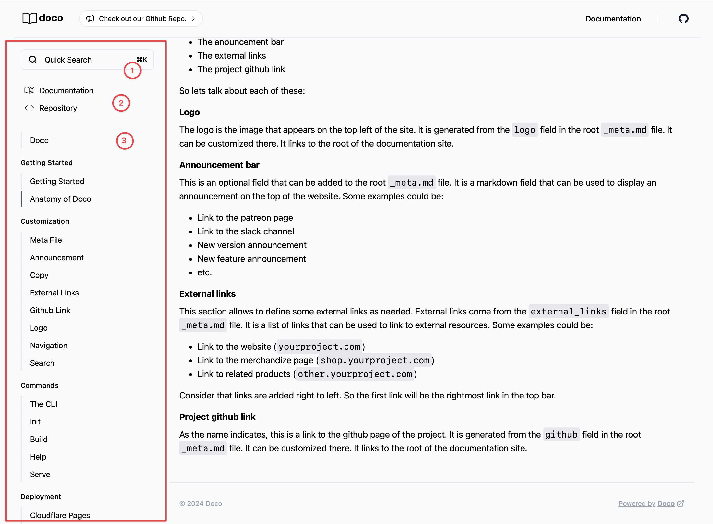
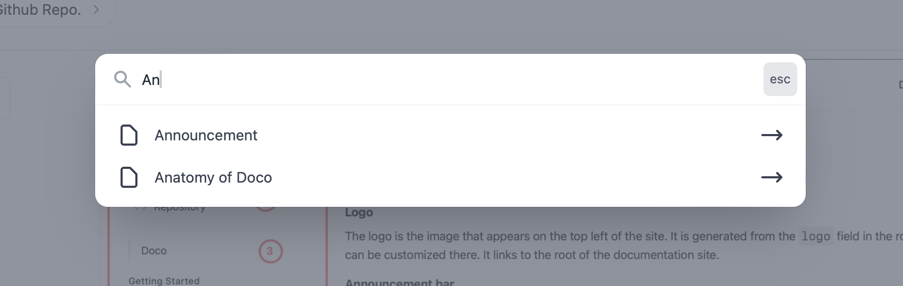

The sidebar contains three elements:

1. The search component
2. The quick links
3. The navigation

Let's go over each of these:

##### Search component

The search component is composed of a button (on top of the sidebar) that triggers a search box. The search box looks in the entire documentation site and display the results in its modal. 

The search bar can be triggered by clicking on the search button or by pressing `Ctrl + K` on the keyboard.

##### Quick links

The quick links are a list of links that are displayed on the sidebar. They are generated from the `quick_links` field in the root `_meta.md` file. It is a list of links that can be used to link to internal resources. Some examples could be:

- Link to the getting started page (`/getting_started.html`)
- Link to the installation page (`/installation.html`)

Quicklinks show on the sidebar and on the search modal. They are a great way to link to important pages in your documentation.

##### Navigation

The navigation is a list of links to the pages in your site. It is generated automatically from the pages in your site. It  creates **one level** of navigation based on folders and pages inside. Files starting with underscore (p.e. _meta.md) are ignored by the navigation builder.

