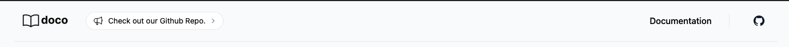

The top navigation bar is a list of links to the pages in your site. It is generated automatically from the pages in your site.

It contains (left to right):
- The logo of the site
- The announcement bar
- The external links 
- The project github link

So lets talk about each of these:

##### Logo

The logo is the image that appears on the top left of the site. It is generated from the `logo` field in the root `_meta.md` file. It can be customized there. It links to the root of the documentation site.

##### Announcement bar
This is an optional field that can be added to the root `_meta.md` file. It is a markdown field that can be used to display an announcement on the top of the website. Some examples could be:

- Link to the patreon page
- Link to the slack channel
- New version announcement
- New feature announcement
- etc.

##### External links

This section allows to define some external links as needed. External links come from the `external_links` field in the root `_meta.md` file. It is a list of links that can be used to link to external resources. Some examples could be:

- Link to the website (`yourproject.com`)
- Link to the merchandize page (`shop.yourproject.com`)
- Link to related products (`other.yourproject.com`)

Consider that links are added right to left. So the first link will be the rightmost link in the top bar.

##### Project github link
As the name indicates, this is a link to the github page of the project. It is generated from the `github` field in the root `_meta.md` file. It can be customized there. It links to the root of the documentation site.
