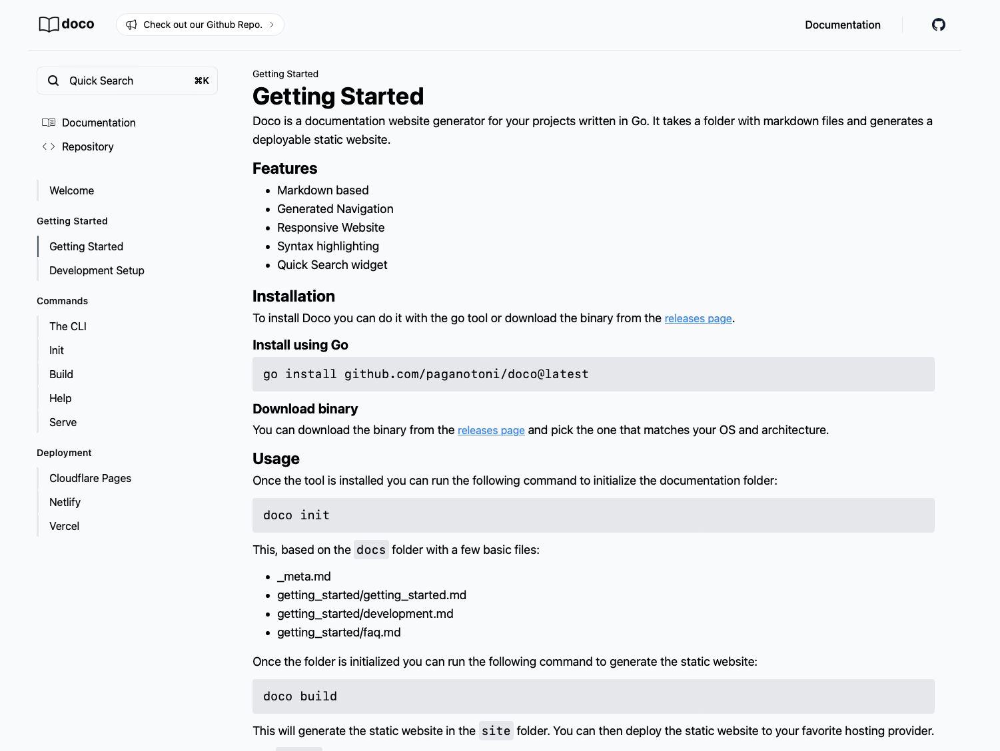

Doco is a documentation generator written in Go. It takes a folder with markdown files and generates a deployable static website ready for your users to consume. The purpose of Doco is to allow you to focus on your documentation and not on the tooling to publish it. 

With Doco you can write your documentation in markdown and generate beautiful websites with a sidebar navigation and a search component.Just like the one you're reading now.

To get started go to the [getting started](/getting_started/getting_started.html) section.